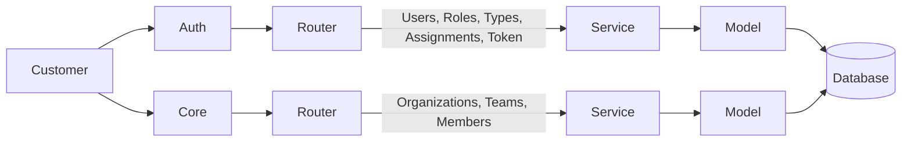

### Organization - Application ###

##  Overview

This project is a FastAPI-based backend system designed using a **microservices architecture**.

The system is divided into two main services:

1. **Auth Service** → Handles authentication and user management
2. **Core Service** → Handles organization, teams, and members

---------------------------

# Services:

1.Auth Service (`auth/auth_server`)

Responsible for:

* User Management
* Authentication (JWT Token)
* Role Management
* Type Management
* Assignments

APIs:

```
POST /auth/v1/users
GET /auth/v1/users
GET /auth/v1/users/{id}
PATCH /auth/v1/users/{id}
DELETE /auth/v1/users/{id}
POST /auth/v1/token
POST /auth/v1/token/decode
POST /auth/v1/roles
GET /auth/v1/roles
PUT /auth/v1/roles/{id}
DELETE /auth/v1/roles/{id}
POST /auth/v1/types
GET /auth/v1/types
PUT /auth/v1/types/{id}
DELETE /auth/v1/types/{id}
POST /auth/v1/assignments
GET /auth/v1/assignments
PUT /auth/v1/assignments/{id}
DELETE /auth/v1/assignments/{id}

```
----------------------

2.Core Service (`core_service/core_apis_server`)

Responsible for:

* Organization Management
* Team Management
* Member Management

APIs:
```
POST /core/v1/organizations
GET /core/v1/organizations
GET /core/v1/organizations/{id}
PATCH /core/v1/organizations/{id}
DELETE /core/v1/organizations/{id}
POST /core/v1/teams
GET /core/v1/teams
GET /core/v1/teams/{id}
PATCH /core/v1/teams/{id}
DELETE /core/v1/teams/{id}
POST /core/v1/members
GET /core/v1/members
GET /core/v1/members/{id}
PATCH /core/v1/members/{id}
DELETE /core/v1/members/{id}

```
---------------------------

##  Request Flow

Each API follows this flow:

Request → Middleware → Router → Service → Model → Database → Middleware → Response

* Router → Handles incoming API requests
* Service → Contains business logic
* Model → Interacts with database (ORM)
* Database → Stores application data

-----------------------------

##  Authentication Flow

1. User generates token using (`/auth/v1/token`)
2. Auth service returns JWT token
3. Client sends token in request headers
4. Core APIs validate token before processing

-------------------------

##  Database Design

# Auth Service Tables:

* Users
* Roles
* Types
* Assignments

# Core Service Tables:

* Organizations
* Teams
* Members

All tables support (soft delete) using:
`deleted_at`
--------------------------

## Exception Handling

Custom exceptions are implemented for better error handling:

* NotFoundException
* AlreadyExistsException
* UnauthorizedException
* ConflictException

----------------------------------------------------------------------

##  How to Run

1. Install dependencies
2. Run Auth Service:
   uvicorn main:app --reload --port 8001

3. Run Core Service:
   uvicorn main:app --reload --port 8002
---------------------------------------------------
## System Architecture:

## 🏗️ System Architecture

## 🏗️ System Architecture


